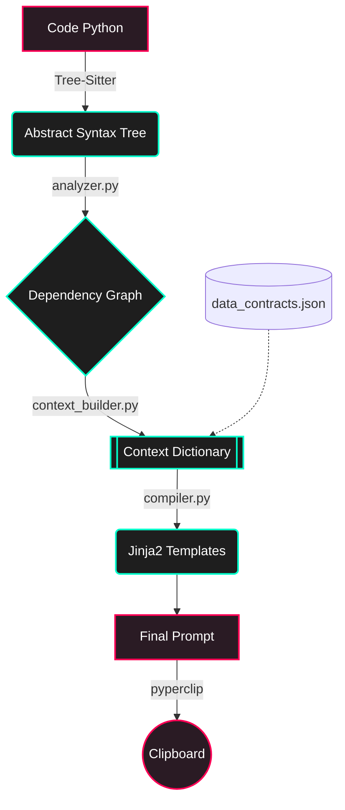

# Kiến Trúc Khung Rủi Ro: Code to Prompt Pipeline

> [!NOTE]
> Hệ thống này là một Compiler chuyên dụng để chuyển đổi ngược từ Mã Nguồn (Code) sang một Prompt "Tất định" (Deterministic Prompt). Mục đích cốt lõi là giới hạn "Blast Radius" (Bán kính rủi ro ảnh hưởng) để AI (như Claude/GPT) không đoán mò, không ảo giác (hallucinate).

---

## 🔄 Tổng Quan Luồng Xử Lý (Data Flow)

---

## 🔍 Chẻ Nhỏ Từng Bước Giới Hạn Tầm Vực

### 1. Code ➡️ AST (Abstract Syntax Tree)
Chúng ta không dùng Regex hay xử lý chuỗi (String processing) vì rất dễ bị lỗi với comment, string, hay code lồng nhau.
- `tree-sitter` (trình biên dịch C siêu tốc) được sử dụng để đọc file `.py` và bẻ nhỏ đoạn code thành một cây hình thái.
- Ở cây này, mỗi thành phần (biến, ký tự, phép gán, định nghĩa hàm, lời gọi hàm) đều là một Node với toạ độ `start_byte` và `end_byte` chính xác.

### 2. AST ➡️ Dependency Graph (`analyzer.py`)
Tách lớp thông tin gọi hàm.
- **Duyệt Cây (Tree Traversal):** DFS đệ quy vào từng nhánh của Node.
- **Bắt Định Danh (Function Def):** Nhận diện đâu là định nghĩa hàm.
- **Bắt Bảng Định Tuyến (Alias Tracking):** Theo dõi các phép gán biến (ví dụ `func = login`).
- **Phân Loại Phép Gọi (Function Call):** Ghi nhớ lời gọi đó là gọi thẳng (`direct_calls`) hay gọi ẩn danh (`alias_calls`). Cắt bỏ luôn các hàm hệ thống (`__builtins__`).
- **Output:** Trả về Đồ thị (Dạng Dictionary) thể hiện chính xác mối quan hệ móc xích: Hàm nào đẻ ra hàm nào.

> [!TIP]
> Việc bắt Alias Tracking ở bước này cực kỳ đắt giá, giúp hệ thống không bị "cởi truồng" (mù) trước những Design Pattern phức tạp như Factory hay Dependency Injection.

### 3. Dependency Graph ➡️ Context (`context_builder.py`)
Đây là **"Bộ Não"** tính toán rủi ro của hệ thống.
- **Layer 1 (Risk Assessment):** Căn cứ vào Target Function (Hàm mục tiêu, vd `login`), nó quét ngược lại đồ thị để phân chia:
   - `high_risk`: Hàm gọi trực tiếp (Impact trực diện).
   - `alias_risk`: Hàm gọi thông qua biến ẩn danh (Rủi ro rình rập).
   - `medium_risk`: Hàm gọi gián tiếp (gọi một hàm mà hàm đó lại đi gọi Target).
- **Layer 2 (Code Stripping):** Trích xuất *chính xác* Text Source Code của những hàm xuất hiện trong vòng tròn rủi ro. Các hàm `low_risk` bị gạch bỏ để "tiết kiệm token" và không làm AI bị nhiễu.
- **Layer 3 (Data Contract):** Tìm trong `data_contracts.json` quy ước cũ và mới của hàm mục tiêu (ví dụ: Đầu ra đổi từ Boolean sang Dict).
- **Output:** Dữ liệu chuẩn hoá thành 1 cục Từ điển (Context_Dict). Mọi output đều được `.sorted()` để giải quyết triệt để tính phiếm định.

### 4. Context ➡️ Template (`compiler.py`)
Đổ khuôn dữ liệu (View Engine).
- **Jinja2 Environment:** Khởi tạo động dưới dạng Global Singleton (`get_env()`) để tránh hao tốn IO.
- Gắn biến `StrictUndefined` bảo vệ hệ thống: thiếu bất kỳ parameter nào thì đập lỗi (Crash) chứ không render nhảm.
- Khớp Context_Dict vào `safe_refactor.j2` hoặc `impact_analysis.j2`.

### 5. Template ➡️ Prompt (`cli.py`)
Sản phẩm cuối cùng (Final Product).
- Text Prompt được xuất ra dính luôn vào bộ nhớ đệm (Clipboard) thông qua `pyperclip`.
- Dev chỉ việc sang nền tảng AI -> Dán bằng `Ctrl+V` -> LLM sẽ ngoan ngoãn hoạt động bên trong "vòng kim cô" hệ thống đặt ra.

> [!IMPORTANT]
> Toàn bộ luồng đi này giải quyết một vấn đề khổng lồ của Prompt Engineering: **"Đừng hy vọng AI đọc cả dự án của bạn rồi tự hiểu, hãy khoanh vùng vấn đề trước cho nó"**.
